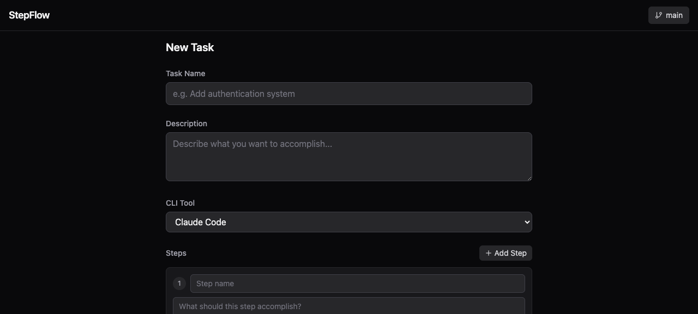
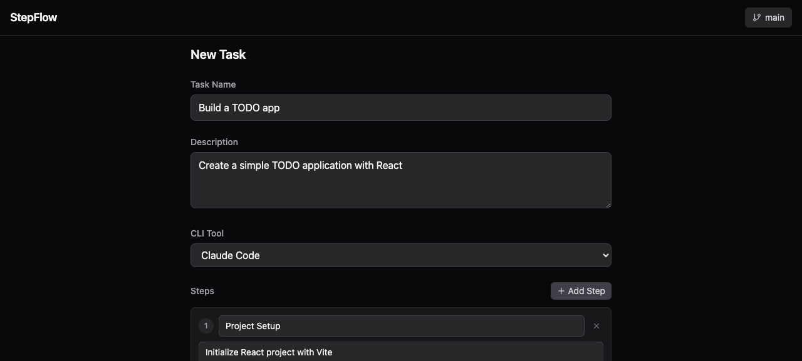
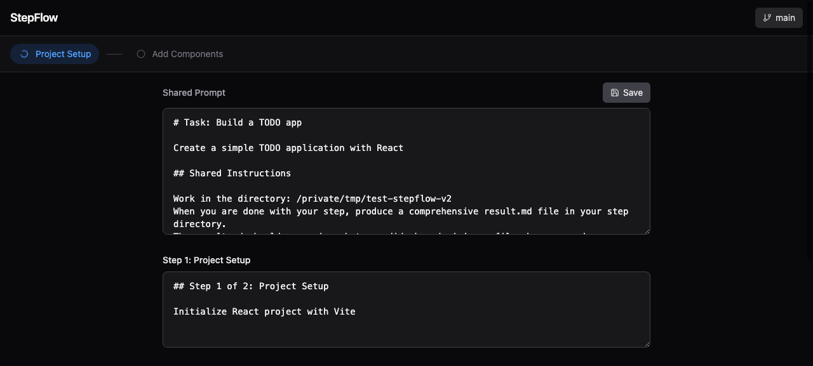

# StepFlow

Step-based agent orchestrator with a live web UI. Break complex tasks into steps, review and edit every prompt before execution, then let [Claude Code](https://docs.anthropic.com/en/docs/claude-code), [Codex](https://github.com/openai/codex) or [OpenCode](https://github.com/opencode-ai/opencode) execute them one by one — with real-time streaming, step-level control, and git integration.

<p align="center">
  
  
  
</p>

## Quick Start

```bash
npx @starsea/stepflow
```

Opens `http://localhost:3120` in your browser. That's it.

### Custom port

```bash
npx @starsea/stepflow --port 8080
```

## Prerequisites

You need **at least one** of these CLI tools installed locally:

| CLI | Install |
|-----|---------|
| Claude Code | `npm i -g @anthropic-ai/claude-code` |
| Codex | `npm i -g @openai/codex` |
| OpenCode | `go install github.com/opencode-ai/opencode@latest` |

## How It Works

### 1. Define your task

Give it a name, description, pick a CLI tool (Claude Code / Codex / OpenCode), and break it into ordered steps.

### 2. Generate

Click **Generate** — StepFlow creates prompt files on disk:

```
.stepflow/
├── shared-prompt.md          # shared context for all steps
├── step-01-setup/
│   └── prompt.md             # this step's specific prompt
├── step-02-implement/
│   └── prompt.md
└── step-03-test/
    └── prompt.md
```

### 3. Review & Edit Prompts

The UI switches to a **prompt editor** where you can fine-tune:
- **Shared prompt** — task-level context injected into every step
- **Per-step prompts** — each step's specific instructions

Edit as much as you need. These are plain markdown files — you can also edit them in your IDE.

### 4. Commit

Use the built-in **Git Panel** to commit your prompt files. This gives you version control over your orchestration before execution.

### 5. Start Execution

Click **Start Execution** when ready. Each step:
- Reads its `prompt.md` + the shared prompt from disk
- Injects the previous step's `result.md` as context
- Runs the agent CLI in JSONL streaming mode
- Produces a `result.md` (up to 500 lines) that feeds into the next step

```
.stepflow/
├── shared-prompt.md
├── step-01-setup/
│   ├── prompt.md             # your prompt
│   ├── output.jsonl          # raw JSONL events
│   └── result.md             # step output → fed to next step
├── step-02-implement/
│   ├── prompt.md
│   ├── output.jsonl
│   └── result.md
└── step-03-test/
    ├── prompt.md
    ├── output.jsonl
    └── result.md
```

## Web UI Features

### Prompt Editor

After generating, review and edit all prompts in a monospace editor:
- **Shared prompt** — appears at the top, applied to every step
- **Step prompts** — one textarea per step, fully editable
- **Save** — writes changes to disk immediately

### Live Agent Output

Events from the agent CLI are parsed and categorized in real time:
- **Messages** — assistant text output
- **Tool calls** — commands, file edits, MCP tools (collapsible details)
- **Reasoning** — model thinking (collapsible)
- **File changes** — created/modified files
- **Plans** — todo lists and task breakdowns
- **Errors** — highlighted in red

### Step Breadcrumbs

Horizontal step indicators at the top:
- Completed steps (green)
- Active step (blue, animated)
- Pending steps (gray)
- Click any completed step to resume from there

### Execution Controls

- **Start Execution** — begins from step 1 (only after review)
- **Stop** — terminate the current agent process
- **Resume from Step N** — re-run from any step (keeps previous results)

### Git Panel

Built-in git operations without leaving the UI:
- View current branch and switch branches
- Create new branches
- View git status and diff
- Commit changes with a message

## Architecture

```
bin/stepflow.mjs          CLI entry point (npx)
src/
├── server.ts             Express server — REST API + SSE
├── normalizer.ts         JSONL event parser (codex/claude/opencode)
├── executor.ts           Step-by-step CLI execution engine
├── script-gen.ts         Prompt file + bash script generator
└── git-ops.ts            Git operations
web/
├── App.tsx               Main React app (input → review → running)
└── components/
    ├── TaskInput.tsx      Task & step definition form
    ├── PromptEditor.tsx   Shared + per-step prompt editor
    ├── StepBreadcrumbs.tsx  Step progress indicators
    ├── AgentOutput.tsx    Live event stream display
    ├── GitPanel.tsx       Git operations sidebar
    └── ControlBar.tsx     Start/Stop/Resume controls
```

### JSONL Event Normalization

StepFlow normalizes the different JSONL output formats from each CLI into a unified event schema (adapted from [blue-core](https://github.com/victor-develop/blue-core)):

```ts
interface NormalizedEvent {
  id: string;
  source: "codex" | "claude" | "opencode";
  family: "message" | "tool" | "reasoning" | "file" | "plan" | "error" | ...;
  phase: "started" | "updated" | "completed" | "failed";
  text?: string;
  toolName?: string;
  command?: string;
  // ...
}
```

This abstraction means the UI works identically regardless of which CLI backend you choose.

## API

StepFlow exposes a REST API on the same port:

| Endpoint | Method | Description |
|----------|--------|-------------|
| `/api/generate` | POST | Generate prompt files from task + steps |
| `/api/prompts` | GET | Read all prompt files (shared + per-step) |
| `/api/prompts` | PUT | Save edited prompts to disk |
| `/api/execute` | POST | Start execution (reads prompts from disk) |
| `/api/stop` | POST | Stop current execution |
| `/api/resume` | POST | Resume from a specific step |
| `/api/events` | GET | SSE stream of execution events |
| `/api/status` | GET | Current execution state |
| `/api/git/status` | GET | Git status |
| `/api/git/branches` | GET | List branches |
| `/api/git/commit` | POST | Create a commit |
| `/api/git/checkout` | POST | Switch/create branch |
| `/api/git/diff` | GET | Git diff |

## Development

```bash
git clone https://github.com/victor-develop/stepflow.git
cd stepflow
npm install
npm run build
npm test           # 84 tests
npm run dev        # start dev server
```

## License

MIT
